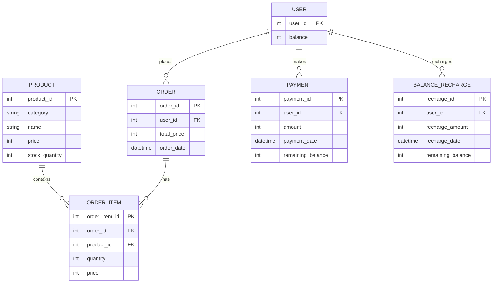

# ERD 설계

## Description

### PRODUCT (상품)
- 상품 정보를 저장
- product_id는 기본키
- 재고 수량(stock_quantity)을 포함

### USER (사용자)

- 사용자 정보를 저장
- user_id는 기본키
- 잔액(balance) 정보를 포함

### ORDER (주문)

- 주문 정보를 저장
- order_id는 기본 키
- user_id는 외래 키로 사용자와 연결
- 총 주문 금액(total_price)과 주문 날짜(order_date)를 포함

### ORDER_ITEM (주문 항목)

- 각 주문에 포함된 상품 정보를 저장
- order_item_id는 기본 키
- order_id와 product_id는 외래 키로 각각 주문 및 상품과 연결

### PAYMENT (결제)

- 결제 내역을 저장
- payment_id는 기본키
- user_id는 외래 키로 사용자와 연결
- 결제 금액(amount), 결제 날짜(payment_date), 잔액(remaining_balance) 정보를 포함

### BALANCE_RECHARGE (잔액 충전)

- 잔액 충전 내역을 저장
- recharge_id는 기본키
- user_id는 외래 키로 사용자와 연결
- 충전 금액(recharge_amount), 충전 날짜(recharge_date), 잔액(remaining_balance) 정보를 포함
