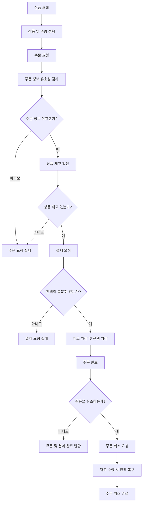

# 플로우차트

### 상품 주문/결제

# Description
- 상품 조회 후 상품 및 수량을 선택한다.
- 주문 요청을 하고 주문 정보를 유효성 검사한다.
- 주문 정보가 유효하지 않으면 주문 요청을 실패한다.
- 주문 정보가 유효하면 상품 재고를 확인한다.
- 상품 재고가 없으면 주문 요청을 실패한다.
- 상품 재고가 있으면 결제를 요청한다.
- 잔액이 충분하지 않으면 결제 요청을 실패한다.
- 잔액이 충분하면 상품 재고를 차감하고 잔액을 차감한다.
- 주문을 취소하면 주문 및 결제를 완료한다.
- 주문을 취소하면 주문을 취소하고 재고 수량과 잔액을 복구한다.
- 주문을 취소하면 주문 취소를 완료한다.
