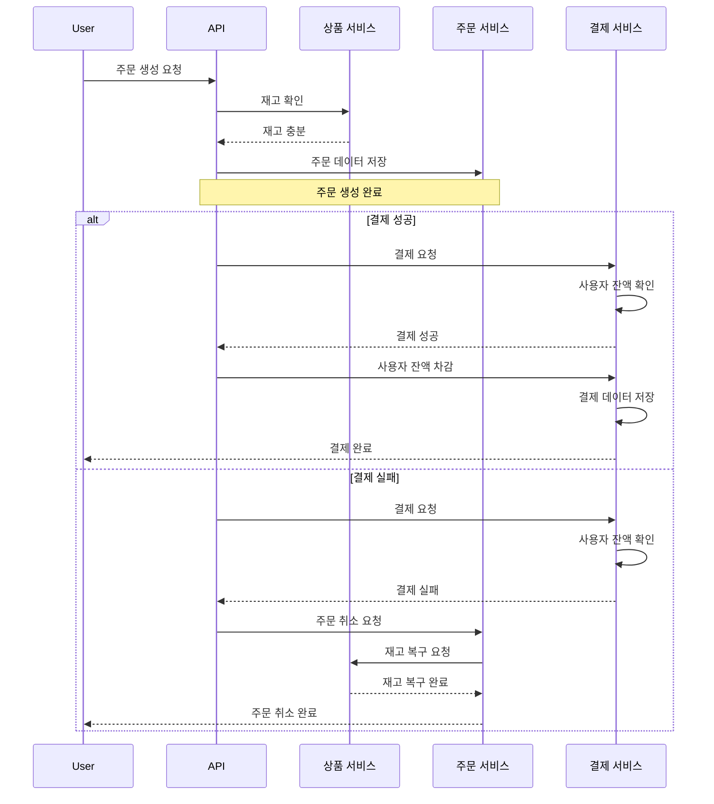

# 시퀀스 다이어그램

# Description

- 사용자가 주문을 생성하면 API를 통해 상품 서비스에 재고 확인을 요청한다.
- 상품 서비스는 재고가 충분하면 API에 재고 충분을 응답한다.
- API는 주문 서비스에 주문 데이터를 저장한다.
- 주문 서비스는 주문 생성 완료를 API에 응답한다.
- 결제가 성공하면 결제 서비스에 결제 요청을 한다.
- 결제 서비스는 사용자 잔액을 확인하고 결제 성공을 API에 응답한다.
- 결제 서비스는 사용자 잔액을 차감하고 결제 데이터를 저장한다.
- 결제 완료를 사용자에게 응답한다.
- 결제가 실패하면 결제 실패를 API에 응답한다.
- API는 주문 취소 요청을 주문 서비스에 전달한다.
- 주문 서비스는 상품 서비스에 재고 복구 요청을 한다.
- 상품 서비스는 재고 복구 완료를 주문 서비스에 응답한다.
- 주문 취소 완료를 사용자에게 응답한다.
